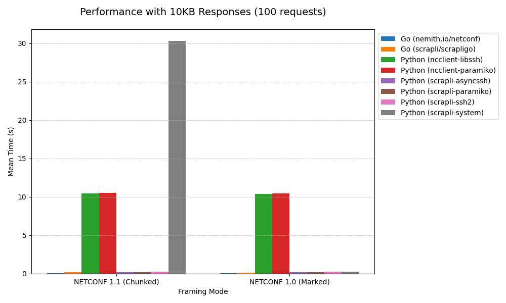
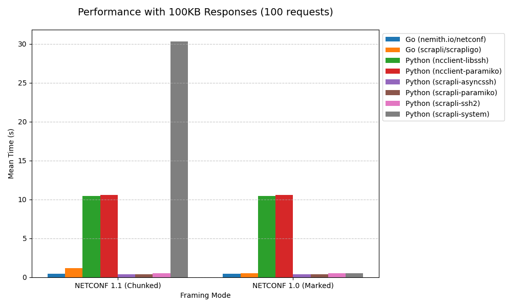
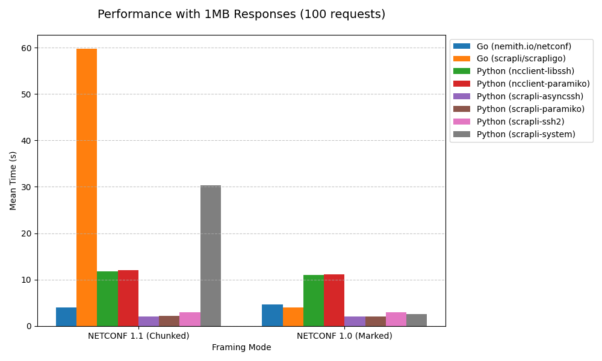

# NETCONF Client Benchmark Suite

A comprehensive benchmark suite for comparing NETCONF client implementations.

## Tested Clients

- **Go**: [nemith.io/netconf](https://github.com/nemith/netconf) (Session.Exec) 
- **Go**: [nemith.io/netconf](https://github.com/nemith/netconf) (Session.Do) 
- **Go**: [scrapli/scrapligo](https://github.com/scrapli/scrapligo) 
- **Python**: [ncclient](https://github.com/ncclient/ncclient) (paramiko) 
- **Python**: [ncclient](https://github.com/ncclient/ncclient) (libssh) 
- **Python**: [scrapli/scrapli-netconf](https://github.com/scrapli/scrapli_netconf) (system) 
- **Python**: [scrapli/scrapli-netconf](https://github.com/scrapli/scrapli_netconf) (paramiko) 
- **Python**: [scrapli/scrapli-netconf](https://github.com/scrapli/scrapli_netconf) (ssh2) 
- **Python**: [scrapli/scrapli-netconf](https://github.com/scrapli/scrapli_netconf) (asyncssh) 

## Interpretation
These benchmarks should be taken with a grain of salt.  This is not intended to be a definitive performance comparison, but rather a way to get a general idea of how different implementations perform under similar conditions. 

This is not intended to compare language performance (Go vs Python), but rather the efficiency of the client libraries and their NETCONF implementations.   

## Benchmark Results

All tests run 100 requests comparing NETCONF 1.1 (Chunked Framing) vs NETCONF 1.0 (Marked Framing).

### 1KB Responses

#### NETCONF 1.1 (Chunked)
| Implementation | Setup (ms) | RPC Calls (ms) | RPS | vs Baseline | Runs |
|----------------|------------|----------------|-----|-------------|------|
| Go: nemith.io/netconf (Do) | 0.0 ± 0.0 | 7.8 ± 1.7 | 12652.4 ± 3333.2 | **baseline** | 10 |
| Go: nemith.io/netconf (Exec) | 0.0 ± 0.0 | 17.3 ± 1.8 | 5706.0 ± 625.4 | 2.22x slower | 10 |
| Python: scrapli-netconf (asyncssh) | 201.4 ± 3.8 | 30.3 ± 2.7 | 3336.4 ± 282.6 | 3.88x slower | 10 |
| Go: github.com/scrapli/scrapligo (standard) | 4.2 ± 0.8 | 134.1 ± 3.8 | 744.0 ± 20.9 | 17.19x slower | 10 |
| Python: scrapli-netconf (paramiko) | 129.7 ± 1.5 | 4119.2 ± 5.1 | 24.3 ± 0.0 | 528.10x slower | 10 |
| Python: scrapli-netconf (ssh2) | 91.8 ± 0.8 | 4119.8 ± 4.0 | 24.3 ± 0.0 | 528.18x slower | 10 |
| Python: ncclient (paramiko) | 148.4 ± 2.0 | 10080.0 ± 2.7 | 9.9 ± 0.0 | 1292.31x slower | 10 |
| Python: ncclient (libssh) | 88.5 ± 1.3 | 10080.8 ± 2.7 | 9.9 ± 0.0 | 1292.41x slower | 10 |

#### NETCONF 1.0 (Marked)
| Implementation | Setup (ms) | RPC Calls (ms) | RPS | vs Baseline | Runs |
|----------------|------------|----------------|-----|-------------|------|
| Go: nemith.io/netconf (Do) | 0.0 ± 0.0 | 8.0 ± 1.3 | 11768.7 ± 2125.6 | **baseline** | 10 |
| Go: nemith.io/netconf (Exec) | 0.0 ± 0.0 | 17.1 ± 1.6 | 5800.0 ± 591.7 | 2.14x slower | 10 |
| Python: scrapli-netconf (asyncssh) | 200.5 ± 4.6 | 26.0 ± 3.3 | 3890.7 ± 466.1 | 3.25x slower | 10 |
| Go: github.com/scrapli/scrapligo (standard) | 3.7 ± 0.8 | 137.4 ± 3.6 | 724.6 ± 19.0 | 17.18x slower | 10 |
| Python: scrapli-netconf (ssh2) | 92.2 ± 1.6 | 2061.8 ± 4.9 | 48.5 ± 0.1 | 257.73x slower | 10 |
| Python: scrapli-netconf (paramiko) | 130.3 ± 2.2 | 2074.2 ± 5.8 | 48.2 ± 0.1 | 259.27x slower | 10 |
| Python: ncclient (libssh) | 87.8 ± 1.0 | 10078.6 ± 4.7 | 9.9 ± 0.0 | 1259.83x slower | 10 |
| Python: ncclient (paramiko) | 144.4 ± 1.7 | 10083.8 ± 2.4 | 9.9 ± 0.0 | 1260.47x slower | 10 |

### 10KB Responses

#### NETCONF 1.1 (Chunked)
| Implementation | Setup (ms) | RPC Calls (ms) | RPS | vs Baseline | Runs |
|----------------|------------|----------------|-----|-------------|------|
| Go: nemith.io/netconf (Do) | 0.0 ± 0.0 | 11.7 ± 2.2 | 8453.4 ± 1729.6 | **baseline** | 10 |
| Python: scrapli-netconf (asyncssh) | 199.9 ± 4.9 | 49.5 ± 5.1 | 2031.0 ± 193.0 | 4.23x slower | 10 |
| Go: nemith.io/netconf (Exec) | 0.0 ± 0.0 | 77.3 ± 4.3 | 1288.6 ± 72.5 | 6.61x slower | 10 |
| Go: github.com/scrapli/scrapligo (standard) | 3.9 ± 1.0 | 266.7 ± 5.2 | 374.4 ± 7.4 | 22.79x slower | 10 |
| Python: scrapli-netconf (ssh2) | 92.1 ± 1.0 | 4116.9 ± 3.4 | 24.3 ± 0.0 | 351.87x slower | 10 |
| Python: scrapli-netconf (paramiko) | 130.0 ± 1.6 | 4117.7 ± 2.8 | 24.3 ± 0.0 | 351.94x slower | 10 |
| Python: ncclient (libssh) | 87.7 ± 0.7 | 10120.6 ± 7.5 | 9.9 ± 0.0 | 865.01x slower | 10 |
| Python: ncclient (paramiko) | 144.9 ± 1.9 | 10121.9 ± 4.4 | 9.9 ± 0.0 | 865.12x slower | 10 |

#### NETCONF 1.0 (Marked)
| Implementation | Setup (ms) | RPC Calls (ms) | RPS | vs Baseline | Runs |
|----------------|------------|----------------|-----|-------------|------|
| Go: nemith.io/netconf (Do) | 0.0 ± 0.0 | 15.2 ± 3.6 | 6672.7 ± 1819.5 | **baseline** | 10 |
| Python: scrapli-netconf (asyncssh) | 197.7 ± 2.9 | 43.9 ± 4.0 | 2297.6 ± 197.0 | 2.89x slower | 10 |
| Go: nemith.io/netconf (Exec) | 0.0 ± 0.0 | 82.2 ± 5.6 | 1215.3 ± 87.0 | 5.41x slower | 10 |
| Python: scrapli-netconf (paramiko) | 129.4 ± 1.4 | 241.5 ± 4.0 | 414.1 ± 6.4 | 15.89x slower | 10 |
| Go: github.com/scrapli/scrapligo (standard) | 4.4 ± 0.8 | 249.4 ± 3.5 | 400.2 ± 5.9 | 16.41x slower | 10 |
| Python: scrapli-netconf (ssh2) | 91.3 ± 0.7 | 2081.0 ± 7.0 | 48.1 ± 0.2 | 136.91x slower | 10 |
| Python: ncclient (libssh) | 87.7 ± 0.8 | 10118.3 ± 3.9 | 9.9 ± 0.0 | 665.68x slower | 10 |
| Python: ncclient (paramiko) | 148.6 ± 1.8 | 10119.2 ± 4.6 | 9.9 ± 0.0 | 665.74x slower | 10 |

### 100KB Responses

#### NETCONF 1.1 (Chunked)
| Implementation | Setup (ms) | RPC Calls (ms) | RPS | vs Baseline | Runs |
|----------------|------------|----------------|-----|-------------|------|
| Go: nemith.io/netconf (Do) | 0.0 ± 0.0 | 32.4 ± 2.4 | 3056.1 ± 227.5 | **baseline** | 10 |
| Python: scrapli-netconf (asyncssh) | 197.8 ± 7.5 | 246.2 ± 6.7 | 406.2 ± 10.8 | 7.60x slower | 10 |
| Go: nemith.io/netconf (Exec) | 0.0 ± 0.0 | 545.5 ± 9.3 | 183.2 ± 3.1 | 16.84x slower | 10 |
| Go: github.com/scrapli/scrapligo (standard) | 4.4 ± 0.8 | 1906.3 ± 35.7 | 52.5 ± 1.0 | 58.84x slower | 10 |
| Python: scrapli-netconf (paramiko) | 128.6 ± 1.2 | 4186.8 ± 4.7 | 23.9 ± 0.0 | 129.22x slower | 10 |
| Python: scrapli-netconf (ssh2) | 91.9 ± 0.7 | 4200.7 ± 4.4 | 23.8 ± 0.0 | 129.65x slower | 10 |
| Python: ncclient (libssh) | 87.8 ± 1.0 | 10216.1 ± 10.4 | 9.8 ± 0.0 | 315.31x slower | 10 |
| Python: ncclient (paramiko) | 146.8 ± 2.1 | 10241.7 ± 9.6 | 9.8 ± 0.0 | 316.10x slower | 10 |

#### NETCONF 1.0 (Marked)
| Implementation | Setup (ms) | RPC Calls (ms) | RPS | vs Baseline | Runs |
|----------------|------------|----------------|-----|-------------|------|
| Go: nemith.io/netconf (Do) | 0.0 ± 0.0 | 72.0 ± 4.3 | 1381.7 ± 81.6 | **baseline** | 10 |
| Python: scrapli-netconf (asyncssh) | 203.0 ± 5.9 | 259.8 ± 11.4 | 385.4 ± 16.4 | 3.61x slower | 10 |
| Go: nemith.io/netconf (Exec) | 0.0 ± 0.0 | 562.6 ± 16.7 | 177.7 ± 5.2 | 7.81x slower | 10 |
| Python: scrapli-netconf (ssh2) | 92.4 ± 0.8 | 999.2 ± 6.2 | 100.1 ± 0.6 | 13.88x slower | 10 |
| Go: github.com/scrapli/scrapligo (standard) | 4.1 ± 0.7 | 1516.0 ± 7.5 | 65.9 ± 0.3 | 21.06x slower | 10 |
| Python: scrapli-netconf (paramiko) | 129.4 ± 1.0 | 1861.2 ± 49.5 | 53.8 ± 1.4 | 25.85x slower | 10 |
| Python: ncclient (libssh) | 88.3 ± 0.8 | 10203.1 ± 9.8 | 9.8 ± 0.0 | 141.71x slower | 10 |
| Python: ncclient (paramiko) | 145.1 ± 1.7 | 10222.8 ± 5.9 | 9.8 ± 0.0 | 141.98x slower | 10 |

### 1MB Responses

#### NETCONF 1.1 (Chunked)
| Implementation | Setup (ms) | RPC Calls (ms) | RPS | vs Baseline | Runs |
|----------------|------------|----------------|-----|-------------|------|
| Go: nemith.io/netconf (Do) | 0.0 ± 0.0 | 266.8 ± 8.1 | 374.3 ± 11.0 | **baseline** | 10 |
| Python: scrapli-netconf (asyncssh) | 200.9 ± 4.2 | 2374.4 ± 38.4 | 42.1 ± 0.7 | 8.90x slower | 10 |
| Python: scrapli-netconf (paramiko) | 128.6 ± 1.9 | 4482.1 ± 93.4 | 22.3 ± 0.5 | 16.80x slower | 10 |
| Python: scrapli-netconf (ssh2) | 92.1 ± 1.2 | 4788.9 ± 60.4 | 20.9 ± 0.3 | 17.95x slower | 10 |
| Go: nemith.io/netconf (Exec) | 0.0 ± 0.0 | 5211.9 ± 145.2 | 19.2 ± 0.5 | 19.53x slower | 10 |
| Python: ncclient (libssh) | 87.4 ± 0.7 | 11332.0 ± 28.9 | 8.8 ± 0.0 | 42.47x slower | 10 |
| Python: ncclient (paramiko) | 147.6 ± 3.2 | 11747.4 ± 58.5 | 8.5 ± 0.0 | 44.03x slower | 10 |
| Go: github.com/scrapli/scrapligo (standard) | 4.7 ± 0.5 | 71244.9 ± 234.4 | 1.4 ± 0.0 | 267.03x slower | 10 |

#### NETCONF 1.0 (Marked)
| Implementation | Setup (ms) | RPC Calls (ms) | RPS | vs Baseline | Runs |
|----------------|------------|----------------|-----|-------------|------|
| Go: nemith.io/netconf (Do) | 0.0 ± 0.0 | 638.3 ± 28.0 | 156.8 ± 7.0 | **baseline** | 10 |
| Python: scrapli-netconf (asyncssh) | 203.4 ± 7.0 | 2568.8 ± 45.8 | 38.9 ± 0.7 | 4.02x slower | 10 |
| Python: scrapli-netconf (ssh2) | 92.0 ± 0.7 | 3179.7 ± 409.2 | 32.0 ± 4.4 | 4.98x slower | 10 |
| Python: scrapli-netconf (paramiko) | 130.1 ± 1.4 | 4521.3 ± 93.0 | 22.1 ± 0.5 | 7.08x slower | 10 |
| Go: nemith.io/netconf (Exec) | 0.0 ± 0.0 | 5562.6 ± 168.9 | 18.0 ± 0.5 | 8.71x slower | 10 |
| Python: ncclient (libssh) | 87.9 ± 0.7 | 10547.4 ± 21.8 | 9.5 ± 0.0 | 16.52x slower | 10 |
| Python: ncclient (paramiko) | 144.9 ± 1.3 | 10742.0 ± 79.1 | 9.3 ± 0.1 | 16.83x slower | 10 |
| Go: github.com/scrapli/scrapligo (standard) | 4.1 ± 0.7 | 14642.0 ± 33.4 | 6.8 ± 0.0 | 22.94x slower | 10 |

## Running Benchmarks

    ./run_benchmark.sh

## Prerequisites

- Go 1.25+
- Python 3.8+ with pandas
- [uv](https://github.com/astral-sh/uv) (for python dependency management)

    # macOS
    pip install pandas
    curl -LsSf https://astral.sh/uv/install.sh | sh

